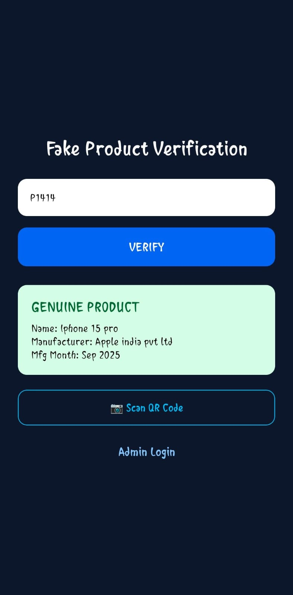
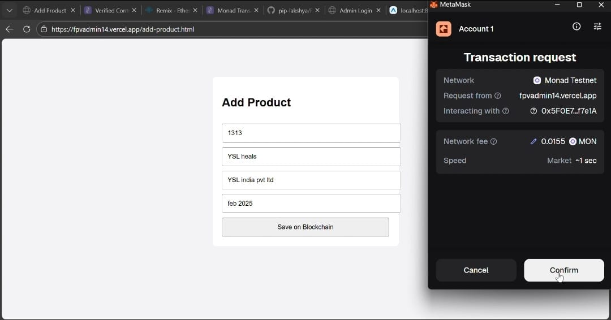

# 🔍 Fake Product Verification System

## 🚀 Overview

Fake Product Verification is a blockchain-based system designed to detect and prevent counterfeit products.
It ensures secure, transparent, and tamper-proof product authentication using decentralized technology.

The system consists of:

* 📱 **Mobile App (User Side)** – allows users to verify products by scanning or entering a Product ID
* 🖥 **Admin Panel (Web Dashboard)** – allows administrators to manage and store product data

---

## 🎯 Problem Statement

Counterfeit products are a major issue due to:

* Centralized databases
* Lack of transparency
* Easy manipulation of product data

Consumers cannot reliably verify whether a product is genuine or fake.

---

## 💡 Solution

This system uses blockchain-based verification to:

* Store product authenticity data securely
* Ensure tamper-proof records
* Provide trustless verification

Users can simply scan or enter a Product ID to check authenticity.

---

## ✨ Features

### 📱 Mobile App

* Verify product using Product ID
* Real-time authenticity check
* Simple and user-friendly interface

### 🖥 Admin Panel

* Add and manage product records
* Control product verification data
* Maintain centralized dashboard

### 🔗 Blockchain Integration

* Tamper-proof data storage
* Transparent verification system

---

## 🎥 Demo & Downloads

### 📽 Demo Video

Watch the working demo:
👉 https://drive.google.com/drive/folders/1kgX1ceJeGG9ZCv5xxu-ECS--Jh9PLH5H

### 📱 APK Download

Download and test the app:
👉 https://drive.google.com/drive/folders/1kgX1ceJeGG9ZCv5xxu-ECS--Jh9PLH5H

> ⚠️ Enable "Install from unknown sources" on your Android device.

---

## 📁 Project Structure

```bash
fake-product-verification/
│
├── admin-panel/     # Web dashboard (HTML, CSS, JS)
├── mobile-app/      # React Native app
```

---

## 🛠 Tech Stack

**Mobile App:**

* React Native
* TypeScript

**Admin Panel:**

* HTML
* CSS
* JavaScript

**Concept:**

* Blockchain-based verification

---

## ⚙️ Setup Instructions

### 🔹 Clone the Repository

```bash
git clone https://github.com/pip-lakshya/fake-product-verification.git
```

---

### 🔹 Run Admin Panel

* Open `admin-panel` folder
* Run using XAMPP / Live Server

---

### 🔹 Run Mobile App

```bash
cd mobile-app
npm install
npx react-native run-android
```

---
## 📸 Screenshots




---

## 🚀 Future Improvements

* QR code scanning integration
* Smart contract-based blockchain system
* Cloud deployment
* AI-based counterfeit detection

---

## 👨‍💻 Team

**Errors on Earth**

---

## 📌 Note

This project is developed for learning, innovation, and demonstration purposes.
